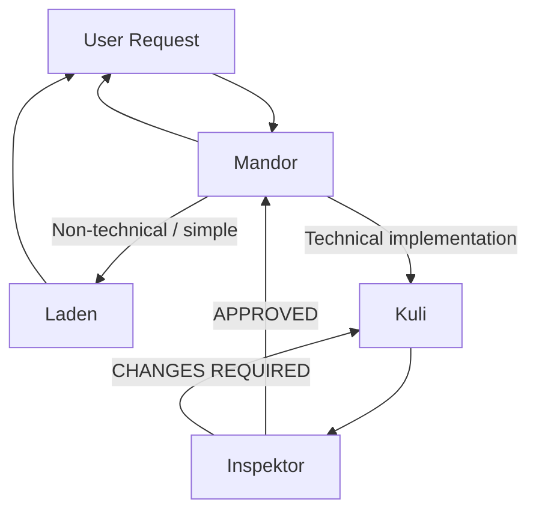

# GitHub Copilot Squad

A custom multi-agent orchestration setup for **GitHub Copilot coding agent**.

This repo defines a 4-agent team with clear roles:
- **Mandor**: router/orchestrator
- **Kuli**: implementation agent
- **Inspektor**: reviewer/QA gate
- **Laden**: general assistant for simple/non-technical requests

The goal is to separate execution and review, so technical tasks go through an implementation + review loop before final output, with different models contributing different perspectives.

## Why this exists

When using one agent for everything, prompts often mix planning, coding, and reviewing in one pass, and the context window can fill up quickly. This setup enforces role separation:
- Technical work is done by a builder agent (`Kuli`)
- Quality is validated by a strict reviewer (`Inspektor`)
- Implementation and review can run on different models, giving a multi-perspective quality check
- Non-technical/simple requests are handled fast by a lightweight helper (`Laden`)
- Routing and iteration control is centralized in `Mandor`

## Repository contents

- `Mandor.agent.md` — orchestration/router profile
- `Kuli.agent.md` — coding/implementation profile
- `Inspektor.agent.md` — review/QA profile
- `Laden.agent.md` — general help profile

## Quick start

### Prerequisites
- GitHub Copilot Chat extension with custom agents support
- VS Code

### Option A — Repo-level agents (recommended)
Store the agent profiles in:
- `.github/agents/*.agent.md`

This makes them available for that repository/workspace.

### Option B — User-level agents
Create/store agent profiles in your user data custom agents location from **Configure Custom Agents...** button in VS Code.

This makes them available across your workspaces.

### Use it
1. Open Copilot Chat in VS Code.
2. Select `Mandor` from the agents dropdown.
3. Ask your request naturally.
4. For technical requests, `Mandor` orchestrates Kuli ↔ Inspektor iterations automatically.

## How the flow works

### 1) Routing
`Mandor` decides where to send the request:
- **Technical implementation request** → `Kuli`
- **Simple/non-technical request** → `Laden`
- **Ambiguous request** → asks a clarification question first

### 2) Technical orchestration loop (Kuli ↔ Inspektor)
For technical requests, `Mandor` runs this loop:
1. Create report folder path: `.github/temp_reports/{YYYYMMDD_HHmmss}_{objective}/`
2. Send task to `Kuli` with `{iteration}` and report path
3. Send results to `Inspektor` for review
4. If `APPROVED` → return final result
5. If `CHANGES REQUIRED` → send review feedback back to `Kuli` with incremented iteration
6. Repeat until approved, max 5 iterations

If still not approved after 5 iterations, `Mandor` stops and surfaces remaining issues.

### Flow diagram

## Agent responsibilities

### Mandor (`Mandor.agent.md`)
- Orchestrates and routes requests
- For technical tasks, manages iterative Kuli-Inspektor loop
- Forwards user prompt/context **verbatim** (no rewriting)
- Uses `#tool:agent/runSubagent` and `#tool:vscode/askQuestions`
- Has `disable-model-invocation: true` (pure router behavior)

### Kuli (`Kuli.agent.md`)
- Handles implementation/coding tasks
- Creates TODO plan, executes changes, runs available tests
- Writes implementation summary report:
  - `.github/temp_reports/{subfolder}/implementation_{iteration}.md`
- Focuses on practical, non-over-engineered solutions

### Inspektor (`Inspektor.agent.md`)
- Reviews technical output for correctness, completeness, quality
- Runs tests when available to detect regressions
- Classifies findings:
  - **Critical** → blocks approval (`CHANGES REQUIRED`)
  - **Minor** → suggestions only
- Writes review report:
  - `.github/temp_reports/{subfolder}/review_{iteration}.md`

### Laden (`Laden.agent.md`)
- Handles simple/general prompts:
  - explanations, brainstorming, casual Q&A, lightweight troubleshooting
- Does not modify code unless explicitly requested
- Keeps responses concise and helpful

## How to use

- Start chat with `Mandor`.
- Ask naturally:
  - Technical request example: “Add endpoint X with validation and tests.”
  - Non-technical request example: “Explain this repository architecture.”
- `Mandor` routes automatically.
- For technical tasks, reports are generated under `.github/temp_reports/` per iteration.

## Report artifacts

During technical tasks, expect:
- `implementation_{iteration}.md` (from `Kuli`)
- `review_{iteration}.md` (from `Inspektor`)

inside:
- `.github/temp_reports/{timestamp_objective}/`

This creates a lightweight audit trail of what was implemented and what was reviewed.

## Customization

Common tweaks you can make:
- Change models in frontmatter (`model:`)
- Restrict/expand tool access (`tools:`)
- Adjust review strictness in `Inspektor`
- Change max loop policy in `Mandor`
- Adapt tone/style prompts

## Official references

- https://docs.github.com/en/copilot/concepts/agents/coding-agent/about-custom-agents
- https://docs.github.com/en/copilot/how-tos/use-copilot-agents/coding-agent/create-custom-agents
- https://docs.github.com/en/copilot/reference/custom-agents-configuration

## License

MIT (see `LICENSE`).
